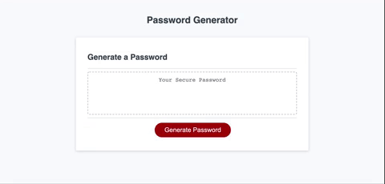

# Jessica Kelley - Password Generator

## Preview:
Check out this [password generator](https://jessicaakelley.github.io/password-generator/)!

 

## The Task:

Create a password generator that:

- Presents a series of prompts for password criteria
- Validates user prompt input making sure at least one character type is selected
- Generates a password once all prompts are answered
- Displays generated password to the page

For additional details, please refer to the [Gitlab](https://ucb.bootcampcontent.com/UCB-Coding-Bootcamp/ucb-virt-bo-fsf-pt-04-2021-u-b/tree/master/03-JavaScript/02-Challenge) project requirements for Challenge 3.

## Technologies Used:

- HTML
- CSS
- JavaScript
